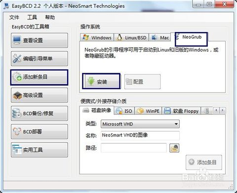

# win7下通过easyBCD引导安装Ubuntu18.04

### **1.准备阶段**

- 在网上下载ubuntu-18.04-desktop-amd64.iso，同时准备好easyBCD软件（网上下载最新版）。将iso文件移动到c盘根目录。
- 打开easyBCD软件，注意到目前只有一个win7启动项。选择“添加新条目”，然后选择“NeoGrub”，点击“安装”。



- 然后点击配置，将menu.lst文件的内容替换成一下文本：

  ```
  title Install Ubuntu
  
  root (hd0,0)
  
  kernel (hd0,0)/vmlinuz.efi boot=casper iso-scan/filename=/ubuntu-14.04-desktop-amd64.iso locale=zh_CN.UTF-8
  
  initrd (hd0,0)/initrd.lz
  
  title reboot
  
  reboot
  
  title halt
  
  halt
  ```

  说明：hd0表示c盘所处的硬盘号，一般电脑只有一个，所以都是hd0；如果有多个硬盘，则根据情况改为hd0、hd1等。

- 经过配置后，c盘中会多出一个“NST”文件夹和一个NeoGrub文件。
  接下来把系统镜像文件用DAEMON tools打开，或者以压缩包形式将其中两个文件解压出来，分别是initrd.lz和vmlinuz.efi（无后缀名的可手动添加），这两个文件在casper文件夹里。

  

- 将解压出来的两个文件复制到c盘根目录。这样，安装系统的前期准备就完成了，重启电脑准备安装ubuntu18.04。

### 2.安装阶段

- 重启电脑，选择“NeoGrub引导加载器”，然后选择“install ubuntu”。

- 等待安装，如果出错，重启电脑进入WIN7检查配置。

- 进入小系统，通过快捷键ctrl+alt+T打开终端，输入：sudo umount -l /isodevice（注意空格和小写的L），执行后双击安装图标“安装Ubuntu18.04LTS”进行安装。

- 选择简体中文；不用选中安装第三方软件和更新，否则安装会很慢，为保险起见可以断开网络连接；安装类型选择“其他选项”。

- 设置分区，首先设置交换空间大小，与电脑内存差不多或为电脑内存的两倍。

  

- 设置其他挂载点的大小，可以简单的设置/、/boot、/home共3个分区，均为ext4文件系统。

  / 10G；/boot 100M;/home 剩余所有空间。注意linux系统的1G对应1000M。

  

- 简单的设置地区、键盘布局，用户名和密码。

- 开始安装系统，如果安装过程在进行下载，可以点击“跳过”，因为系统安装完成后同样可以更新下载。

- 安装完成后点击“现在重启”。回到win7系统打开easyBCD软件把“NeoGrub”引导项删除，否则每次进入win7都得选一次。

  