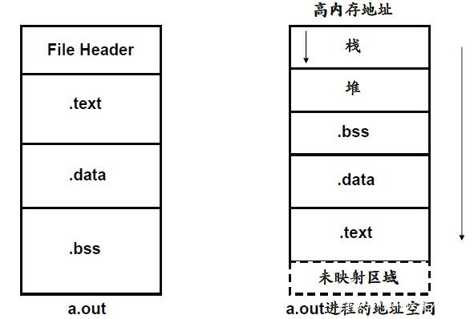

## C语言基础

- 内存结构图
  

- 堆和栈的区别:
  + 栈是一种可以实现“先进后出”（或者称为“后进先出”）的存储结构，堆则是一种经过排序的树形数据结构。
  + 栈内存是由编译器自动分配与释放的，而堆内存则完全是由程序员手动申请与释放的。
  + 对栈而言，一般用于存放函数的参数与局部变量等；对堆而言，具体存储内容由程序员根据需要决定存储数据。

- 引用头文件

  ```c
  #include  <stdio.h>
  ```

- 入口函数

  ```c
  int  main(int argv,char* argc[])
  {
  		printf("  ");
  		return 0;
  }
  ```

- 基本函数

  - printf("%d,%d,%d,%d",var1,var2,var3,var4)  :  依次输出4个变量
  - fprintf(stdout,"")  :  打印到输出流
  - fprintf(stderr,"")  :  打印到错误流
  - scanf("%d,%d,%d",$i,$j,$k)  :  接受键盘输入，并依次赋值给$i,$j,$k

- 编译

  ```
  cc  file.c        ##默认编译结果文件名为  a.out
  cc  file.c  -o  file.out
  cc  file0.c  file1.c  file2.c  -o  file.out
  
  gcc  file.c        ##默认编译结果文件名为  a.out
  gcc  file.c  -o  file.out
  gcc  file0.c  file1.c  file2.c  -o  file.out
  
  [-g]    支持调试
  ```

- 程序执行及传递参数

  ```
  (dirname)/filename.out  arg1  arg2  arg3  arg4
  ```

- 输出流

  输出流:  stdout(默认输出到终端)
  重定向:

  - file.out  >>  output.txt  (在末尾追加内容)
  - file.out  >  output.txt  (覆盖原有内容)
  - file.out  1>  output.txt(标准输出流)
  - file.out  2>  output.txt(标准错误流)

- 输入流

  输入流:stdin(默认由键盘输入)
  键盘输入:`scanf('%d',$varname)`
  重定向：

  - file.out  <  input.text

- 错误流:stderr

## 内存与指针

- 内存基本结构:

  > 栈:  存储变量值及函数运行状态
  >
  > 堆:
  >
  > 数据段:  存储变量名
  >
  > 代码段:  存储代码

- 指针表示:  `*pointer`

- 地址表示:  `&address`

- 调试器:  `gdb`

## **变量声明与定义**

- 声明： `extern int i`;    `extern int i,  j,  k`;
- 声明并初始化： `extern int i=1`;    `extern int i=1,  j=2,  k=3`;
- 定义：`int i`;    ` int i,  j,  k`;
- 定义并初始化：`int i=1`;    ` int i=1,  j=2,  k=3`;

## **常量声明与定义**

- `const  type variable = value`  exp:  `const int x=10`(给常量x赋值10)
- `#define identifier value`  exp: `#define y 100`(给常量y赋值100)

## **flag格式字符**

| 格式字符 |                    意义                    |
| :------: | :----------------------------------------: |
|    d     | 以十进制形式输出带符号整数(正数不输出符号) |
|    o     |  以八进制形式输出无符号整数(不输出前缀0)   |
|   x,X    | 以十六进制形式输出无符号整数(不输出前缀Ox) |
|    u     |         以十进制形式输出无符号整数         |
|    f     |        以小数形式输出单、双精度实数        |
|   e,E    |        以指数形式输出单、双精度实数        |
|   g,G    | 以%f或%e中较短的输出宽度输出单、双精度实数 |
|    c     |                输出单个字符                |
|    s     |                 输出字符串                 |
|    p     |                输出指针地址                |
|    lu    |               32位无符号整数               |
|   llu    |               64位无符号整数               |